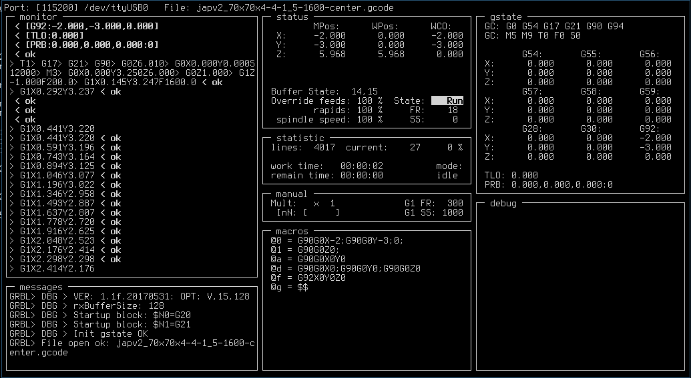

# ncgcs
perl curses based GRBL G-code sender and tools

Install (ArchLinux):
`pacman -S perl perl-curses perl-device-serialport`

Run:
`perl ncgcs.pl g-code.file`

Help: <?>
```
┌─ help ──────────────────────────────────────────────────────────────────────────────────────────────────────────────┐
│ Ctrl+C - program exit     Mode: @ = macro      Jog mode:                                                            │
│ ESC - mode exit ||              : = command    h,H - left, l,L - right, j,J - down, k,K - up (like vi)              │
│       cancel jogging ||         J = jog        a,A - axis Z up, z,Z - axis Z down (h,j,k,l,a,z for F<frg0>)         │
│       cancel input                                                                (H,J,K,L,A,Z for F<frg1>)         │
│                                                (s-x, d-c, f-v - key for A,B,C axis)                                 │
│ Ctrl+X - soft reset (reset gcmd)               q - mult = 0.1 mm(inch)/step                                         │
│ ! - hold                                       w - mult = 1   mm(inch)/step (default)                               │
│ ~ - resume                                     e - mult = 10  mm(inch)/step                                         │
│ O - home ($H)                                  r - mult = 100 mm(inch)/step                                         │
│ U - unlock ($X)                                g - set feedrate for G1                                              │
│ S - start send g-code                          b - set value for S                                                  │
│ P - pause/resume send G-code                    ie:  100f = set 100 for feedrate G1 <frg1>                          │
│ T - set origin (G92X0Y0Z0)                          w124L = $J=G91X124F<frg1> ,                                     │
│ * - refresh GRBL state                              q133J = $J=G91Y-13.3F<frg1> ,                                   │
│ R - reload file statistic                             r2k = $J=G91Y200F<frg0> etc...                                │
│ N - input filename .gcode                                                                                           │
│                                                                                                                     │
│ : = cmd mode (the up and down arrow keys are   @<key>  - exec macros <key>                                          │
│     available to access the command history)   @"<key> - edit macros <key>                                          │
│                                                                                                                     │
│ Ctrl+R - regedit mode:                                                                                              │
│   <Ctrl+R>REGNUM<Enter> - edit register (Enter = Save it)                                                           │
└─────────────────────────────────────────────────────────────────────────────────────────────────────────────────────┘
```
**Note:**

 - test on GRBL 1.1f
 - no mouse, only keybinding
 - Streaming Protocol: Character-Counting
 - in win32 working with reservation :) (tuning need)
 - work in progress :)

**Screenshot:**


